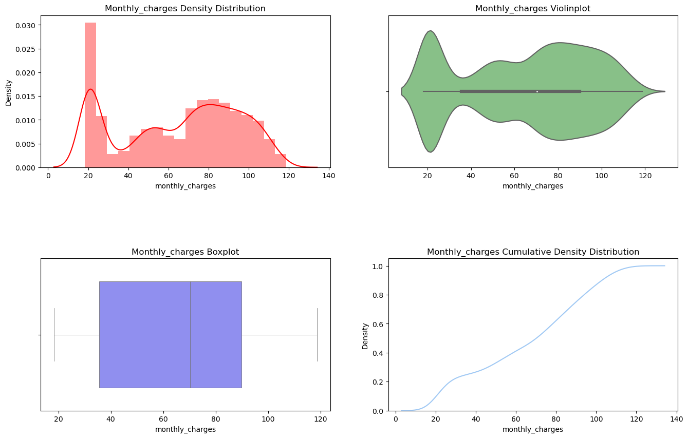
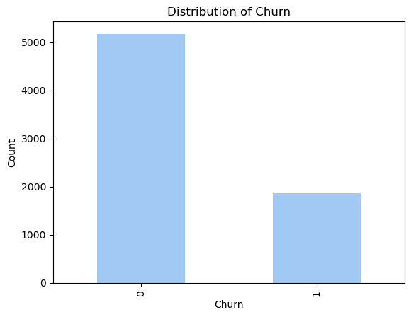
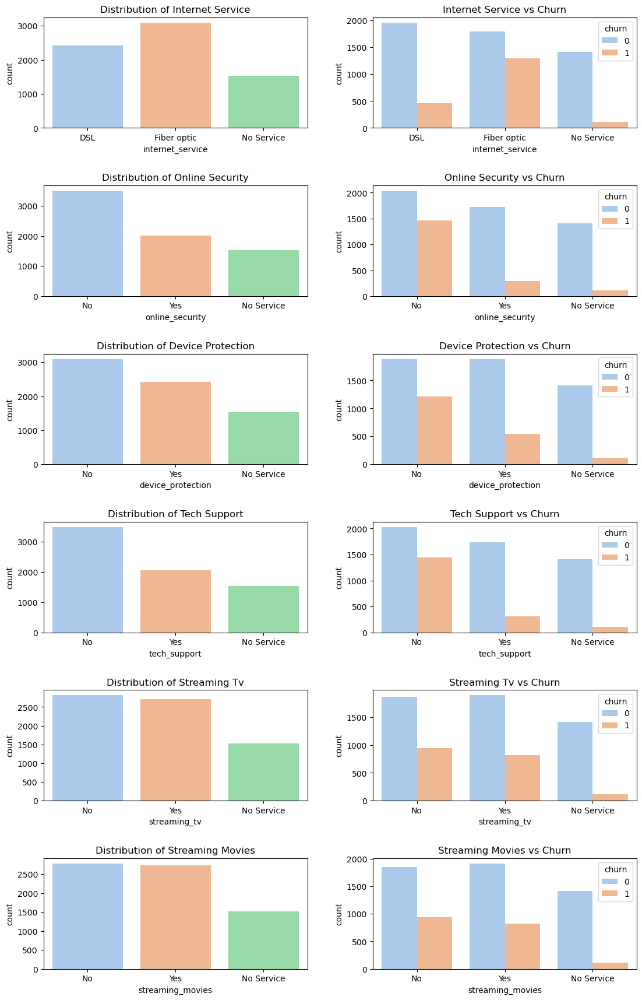
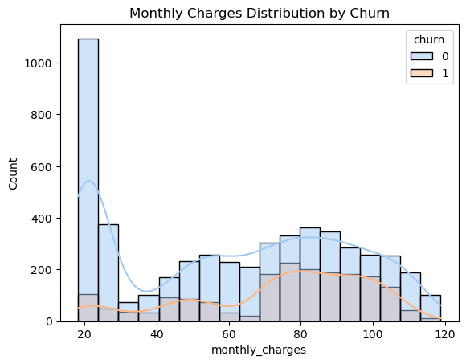
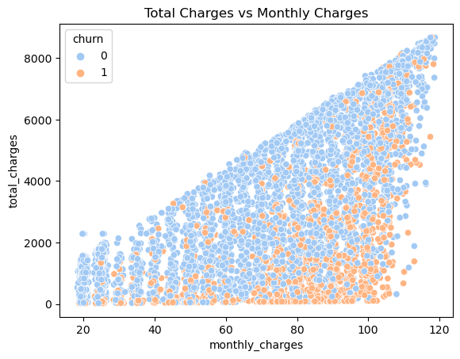
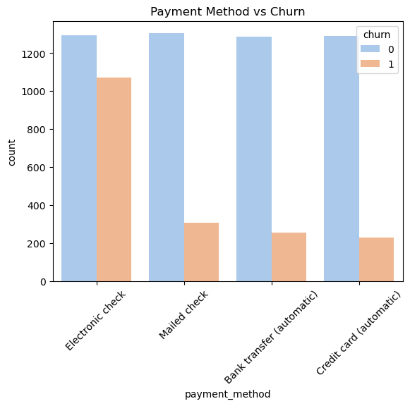
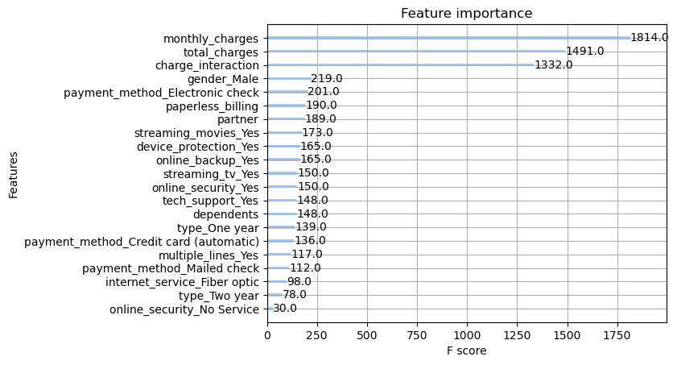
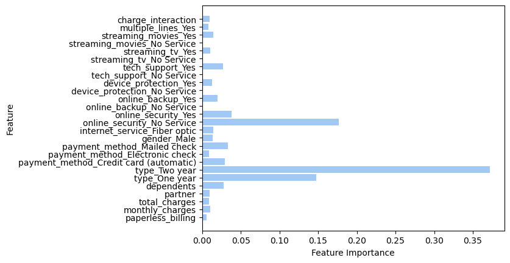
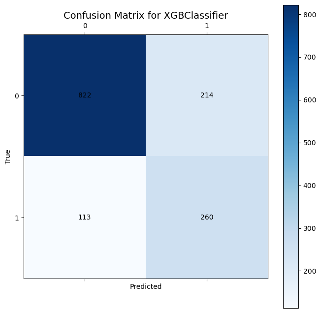
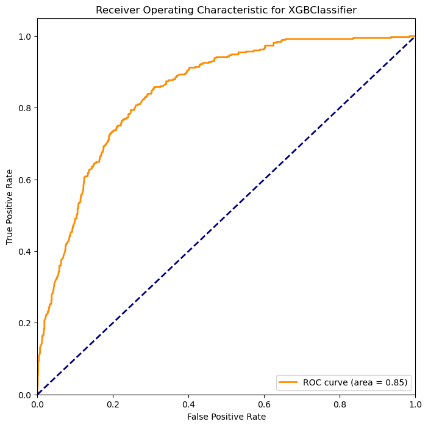

# Telecom-Churn-Prediction
# Predictive Churn Analysis for Telecom Services Using Machine Learning

The project focuses on creating a predictive model to tell which customers are likely to keep of discontinue their telecom operator's services. This entails initial analysis of datasets covering contracts, personal, and internet/phone service usage details. A thorough exploratory data analysis will uncover trends and guide feature engineering. Emphasis will be on one-hot encoding for categorical variables and devising new features that reflect customer behavior.

Using boosting algorithms, the project aims to leverage capacity for binary classification and to fine-tune the predictive model through hyperparameter optimization. The primary performance metric, the AUC-ROC score, will gauge the model's success in finding potential churn from loyal customers, and should result in 0.88 or above.

The project aims to equip the telecom operatoring company with the ability to find those likely to churn and proactively send targeted promotions and customer retention plan options.

## Interconnect's services
Interconnect mainly provides two types of services:
1. Landline communication. The telephone can be connected to several lines simultaneously.
2. Internet. The network can be set up via a telephone line (DSL, digital subscriber line) or through a fiber optic cable.

Some other services the company provides include:
- Internet security: antivirus software (DeviceProtection) and a malicious website blocker (OnlineSecurity)
- A dedicated technical support line (TechSupport)
- Cloud file storage and data backup (OnlineBackup)
- TV streaming (StreamingTV) and a movie directory (StreamingMovies)

The clients can choose either a monthly payment or sign a 1- or 2-year contract. They can use various payment methods and receive an electronic invoice after a transaction.

The data consists of files obtained from different sources:
- contract.csv — contract information
- personal.csv — the client's personal data
- internet.csv — information about Internet services
- phone.csv — information about telephone services
In each file, the column customerID contains a unique code assigned to each client.

The combination of these plots provides a comprehensive view of how monthly charges are distributed among customers. The presence of a large number of customers at the lower end of the spectrum could indicate a base tier of services, while the multiple peaks observed in the KDE and violin plots suggest the existence of several pricing tiers or bundled services.

The box plot's median value is close to the higher end of the lower IQR, indicating that more than 25% of customers pay above the median monthly charge. The outliers in the box plot could be customers with premium services or multiple add-ons.

The cumulative density plot's smooth curve indicates no abrupt changes in the billing structure, which would be seen as steep slopes in such a plot.

The graph displays a significant class imbalance between the two classes: '0' (No Churn) and '1' (Churn). There are noticeably more customers who have not churned ('0') compared to those who have ('1'). This imbalance is a common issue and will be addressed during the modeling phase to prevent the model from being biased toward the majority class.

**Central Tendency:** The median monthly charge for customers who churn ('1') appears to be higher than for those who do not churn ('0'). This suggests that higher monthly charges could be associated with a greater likelihood of churn.

**Spread and Variability:** The interquartile range (IQR) for both groups is substantial, indicating variability in the monthly charges among customers. However, the IQR for churned customers seems to be wider, implying more variability in the amounts they were charged compared to those who didn't churn.

**Outliers:** The presence of outliers, the whiskers, in both categories shows that there are customers with monthly charges that are significantly higher or lower than the typical customer. 

The boxplot indicates that pricing strategy may influence churn. Customers who churn are potentially those who are on higher-priced plans or have additional services that increase their monthly charge. This can signal the need for reviewing pricing structures or customer segmentation in terms of service usage.

**Monthly Charges and Churn:** There is a positive correlation (0.19) between 'monthly_charges' and 'churn'. This indicates that higher monthly charges are somewhat associated with an increased likelihood of churn. 

**Total Charges and Churn:** The correlation between 'total_charges' and 'churn' is slightly negative (-0.2). This could imply that customers with higher total charges over time are slightly less likely to churn. This might reflect a sense of loyalty or satisfaction among customers who have been with the company longer and thus have accrued higher total charges.

**Monthly Charges and Total Charges:** There is a relatively strong positive correlation (0.65) between 'monthly_charges' and 'total_charges'. This is expected since customers with higher monthly payments will accumulate higher total charges over time. It's also possible that customers with more services subscribed to or higher-tier plans contribute to this correlation.

While 'monthly_charges' show a positive correlation with churn, suggesting that customers on higher monthly plans are more prone to leaving, the negative correlation of 'total_charges' with churn could indicate that long-term customers or those who have spent more with the company tend to stay. This suggests that while price sensitivity may affect customer retention, there's also value in nurturing long-term customer relationships.

**Internet Service:** The left chart shows the distribution of internet services among customers. There is a substantial number of customers with DSL, a higher number with fiber optic, and a segment without any service.
The right chart shows that customers with fiber optic service have a higher churn rate compared to DSL and those with no service.

**Online Security:** Many customers do not have online security services, and a significant proportion of those without online security churn, as seen in the churn comparison chart.

**Device Protection:** Similar to online security, a large number of customers do not subscribe to device protection, and those without it seem more likely to churn.

**Tech Support:** The distribution is similar to that of online security and device protection. Customers without tech support services tend to churn more often.

**Streaming TV:** While there are customers who subscribe to streaming TV, the churn rate does not seem drastically different across the categories.

**Streaming Movies:** The distribution and churn pattern for streaming movies is similar to that of streaming TV.

### General Observations:
- Service Features and Churn: Customers without additional service features such as online security, device protection, and tech support show a tendency towards higher churn rates. This suggests that these services could play a role in customer retention.

- Fiber Optic Service: There is a notable churn rate among customers with fiber optic internet service. This could be due to various factors such as price, service quality, or competition.

- Value-Added Services: The general trend suggests that customers who do not subscribe to additional services have higher churn rates. This could indicate that customers who are more engaged with the company's services are more likely to stay.

**Potential Strategies:** The company might consider strategies to encourage the adoption of value-added services, which could improve customer retention. Offering bundled services, promotions, or improved support could be effective.

**Streaming Services:** Churn rates for streaming TV and movies don't show as clear a trend as other services, indicating that different factors might influence churn for customers interested in streaming.

**Gender vs Churn:** The charts suggest that gender does not have a pronounced difference in churn rates, as both female and male customers have similar churn counts.

**Senior Citizen vs Churn:** The chart shows a higher proportion of churn among senior citizens compared to non-senior citizens. This could suggest that senior citizens are either more sensitive to certain aspects of the service or they have different expectations and needs that are not being met.

**Partner vs Churn:** Customers without a partner appear to churn more than those with a partner.
This might be due to single customers being more flexible and less tied down by family plans, making it easier for them to switch providers.

**Dependents vs Churn:** Similarly to 'Partner', customers without dependents churn more than those with dependents.
Having dependents might imply a more stable household that prefers continuity with service providers or could be benefiting from family plans.

#### Implications for Business Strategies:
- Senior Citizen Engagement: Given the higher churn rate among senior citizens, the company might consider developing targeted engagement strategies, such as offering senior discounts or services tailored to older adults' preferences.
- Family Plans and Stability: The lower churn rates for customers with partners or dependents suggest that family plans or services that cater to households might improve customer retention.
Gender Neutrality in Services: The similar churn rates across genders suggest that the company's services are perceived similarly by all genders, or that different factors are influencing the decision to churn.

These demographic insights can guide more personalized marketing and customer service initiatives. For example, providing more supportive services for senior citizens or offering incentives for family plans could be effective.

The histogram shows 'Monthly Charges' distribution for churned and retained customers. Customers with lower charges tend to stay with the company, while those with higher charges are more likely to churn. This suggests that higher pricing may be a factor in customer churn. The company could benefit from examining its pricing structure and possibly offering retention incentives to higher-paying customers to reduce churn.

The data points create a triangular pattern, suggesting a relationship between time with the company and the monthly payment amount. Customers with lower total and monthly charges show a mix of churn, while higher total charges, which likely indicate longer tenure, have fewer instances of churn.

At higher monthly charges, churn instances increase regardless of the total charges. This could indicate that customers are more sensitive to higher monthly payments, leading to churn regardless of their tenure.

The plot implies that while long-term customers tend to stay, those with higher monthly payments might be at risk of churning and may need targeted retention strategies.

**Electronic Check:** A significant number of customers who use electronic checks tend to churn, as indicated by the proportionally high orange bar. This might suggest dissatisfaction with this payment method or that this group could include more new or tech-savvy customers who are also more comfortable changing providers.

**Mailed Check, Bank Transfer, and Credit Card:** These payment methods show lower churn rates compared to electronic checks. It seems customers using these methods are less likely to churn, potentially indicating a more stable customer base or a preference for traditional payment methods.

#### Strategic Implications: 
The company might consider investigating why customers using electronic checks are more prone to churn. It could be beneficial to offer incentives for using more stable payment methods or to improve the electronic check system if issues are present. Encouraging customers to switch to automated payments could potentially reduce churn, as these methods appear to have a lower associated churn rate.

The feature importance chart shows 'monthly_charges' and 'total_charges' as the top indicators of customer churn, suggesting billing amounts are key predictors. Payment methods, especially electronic checks, and service features like streaming and security services also influence churn but to a lesser extent. Demographics and contract types have a role, but they're less critical than financial factors. The negative importance for 'online_security_No Service' may need further investigation to understand its significance. Overall, financial aspects are the strongest predictors of churn in this model.

The chart highlights billing factors, contract terms, and payment methods as key predictors of churn. Service features and demographics also play a role but are less significant. Overall, financial and contractual aspects are critical in influencing customer retention.

The ROC curve provided with an area under the curve (AUC) of 0.85 indicates a very good predictive performance of the XGBClassifier. The AUC value ranges from 0 to 1, where 1 indicates perfect prediction and 0.5 denotes a performance no better than random chance. With an AUC of 0.85, the classifier is considered to have a high level of discriminative ability to distinguish between the positive class (churn) and the negative class (no churn).

The project successfully navigated through data preprocessing, exploratory analysis, and model development to create a reliable churn prediction model. The difficulties faced along the way, such as class imbalance and feature encoding, were overcome through strategic data augmentation and preprocessing. The key to solving the task was a blend of thorough EDA, feature engineering, and model tuning, which together led to the selection of an **XGBClassifier** with predictive power. The **ROC-AUC score of 0.85** signifies that the model is well-tuned and capable of accurately identifying potential churn risks, which can significantly benefit the telecom operator's customer retention strategies.

Steps Performed:
1. **Data Preprocessing:** This included handling missing values, encoding categorical variables, and normalizing numerical features. All necessary preprocessing steps were executed to prepare the data for modeling.

2. **Exploratory Data Analysis (EDA):** A comprehensive EDA was performed to understand the distributions and relationships within the data. This step was crucial for feature selection and informed the modeling process.

3. **Feature Engineering:** Created new features and interactions to enhance model performance, like 'charge_interaction', which turned out to be significant.

4. **Model Selection and Training:** Experimented with several algorithms, including Random Forest and XGBoost, to find the best predictive performance.

5. **Model Tuning:** Hyperparameter tuning was conducted using techniques such as GridSearchCV to optimize the model.

6. **Model Validation:** Cross-validation was used to ensure the model's robustness.

7. **Final Model Training:** The model was retrained on the entire dataset using the best hyperparameters found during tuning.

Difficulties Encountered:
- Class Imbalance: Significant class imbalance was addressed using SMOTE to avoid model bias towards the majority class.

- Feature Encoding: Initially, the model failed to handle non-numeric data. This was resolved by encoding categorical variables into a format suitable for machine learning algorithms.

- Model Complexity: Overfitting was a concern with complex models. This was mitigated by tuning hyperparameters and using regularization techniques.

The **Exploratory Data Analysis (EDA)** across various graphs provides several key insights into factors that may influence customer churn:

**Pricing:** Higher monthly charges are associated with increased churn, suggesting price sensitivity among customers. However, customers with higher total charges, which could indicate longer tenure, tend to churn less.

**Service Features:** Customers without additional service features like online security, device protection, and tech support show higher churn rates. This indicates the potential value of these services in customer retention.

**Internet Service:** There is a higher churn rate among customers with fiber optic services compared to those with DSL, suggesting possible issues with the fiber optic service that need to be addressed.

**Demographics:** Senior citizens and customers without partners or dependents exhibit higher churn rates. This highlights an opportunity for targeted marketing and retention strategies.

**Payment Method:** Customers using electronic checks have a higher churn rate compared to other payment methods. This could point to the need for a review of the electronic payment process or to address specific customer needs within this group.

**Gender**: The churn rate does not significantly differ between genders, indicating that churn is influenced more by other factors than by gender alone.

In conclusion, the company could focus on reviewing its pricing strategies, especially for higher-priced plans, to ensure they align with customer expectations. Additionally, promoting the value of service features and considering changes to payment options could help in retaining customers. Targeted efforts to address the needs of senior citizens and customers without dependents or partners could further enhance customer loyalty and reduce churn rates.
